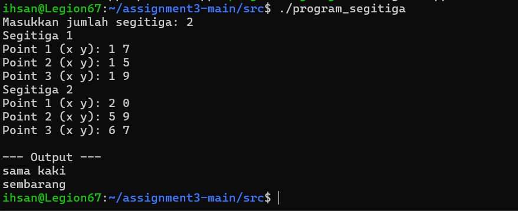

# Programming Assignment 3

**Nama:** Muhammad IHsan Malarangeng  
**NRP:** 5024251067

## 1. Pendekatan Penyelesaian
Untuk menyelesaikan tugas ini, dilakukan pendekatan Object-Oriented Programming (OOP) yang menggabungkan kelas `Point2D` dan `Triangle`. 

1. **Perbaikan Bug:** Ditemukan kesalahan pada template awal `point2d.hpp` (fungsi `SetY` dan `SetZ` tidak beroperasi sebagaimana mestinya). Hal ini diperbaiki dengan `_y = y` dan `_z = z`.
2. **Custom Namespace:** Seluruh definisi kelas `Point2D` dan `Triangle` dibungkus dalam `namespace geometry`.
3. **Logika Matematika:** Di dalam file `triangles.cpp`, fungsi pengecekan `TriangleType()` menggunakan formula jarak euklides 2D. Hasil dari panjang setiap sisi di-*sort* ke dalam vector kecil agar sisi terpanjang (Hipotenusa) dapat langsung dievaluasi dengan teori Pythagoras $a^2 + b^2 = c^2$.
4. **Toleransi Float:** Evaluasi antar titik menggunakan variabel *epsilon* (`1e-4`) untuk menghindari eror presisi komparasi tipe data float di C++.

## 2. Contoh Input / Output

**Input:**
```text
Masukkan jumlah segitiga: 3
Segitiga 1
Point 1 (x y): 0 0
Point 2 (x y): 3 0
Point 3 (x y): 0 4
Segitiga 2
Point 1 (x y): 0 0
Point 2 (x y): 2 0
Point 3 (x y): 1 3
Segitiga 3
Point 1 (x y): 0 0
Point 2 (x y): 4 0
Point 3 (x y): 2 1
```
contoh output


